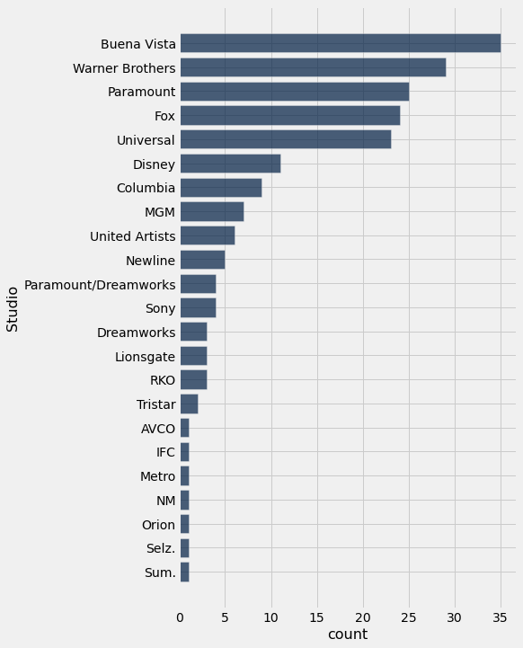

```python
from datascience import *
import numpy as np

%matplotlib inline
import matplotlib.pyplot as plots
plots.style.use('fivethirtyeight')
```

## Lecture 4 ##

## Census ##


```python
full = Table.read_table('nc-est2014-agesex-res.csv')
full
```


<table border="1" class="dataframe">
    <thead>
        <tr>
            <th>SEX</th> <th>AGE</th> <th>CENSUS2010POP</th> <th>ESTIMATESBASE2010</th> <th>POPESTIMATE2010</th> <th>POPESTIMATE2011</th> <th>POPESTIMATE2012</th> <th>POPESTIMATE2013</th> <th>POPESTIMATE2014</th>
        </tr>
    </thead>
    <tbody>
        <tr>
            <td>0   </td> <td>0   </td> <td>3944153      </td> <td>3944160          </td> <td>3951330        </td> <td>3963071        </td> <td>3926665        </td> <td>3945610        </td> <td>3948350        </td>
        </tr>
        <tr>
            <td>0   </td> <td>1   </td> <td>3978070      </td> <td>3978090          </td> <td>3957888        </td> <td>3966510        </td> <td>3978006        </td> <td>3943077        </td> <td>3962123        </td>
        </tr>
        <tr>
            <td>0   </td> <td>2   </td> <td>4096929      </td> <td>4096939          </td> <td>4090862        </td> <td>3971573        </td> <td>3979952        </td> <td>3992690        </td> <td>3957772        </td>
        </tr>
        <tr>
            <td>0   </td> <td>3   </td> <td>4119040      </td> <td>4119051          </td> <td>4111920        </td> <td>4102501        </td> <td>3983049        </td> <td>3992425        </td> <td>4005190        </td>
        </tr>
        <tr>
            <td>0   </td> <td>4   </td> <td>4063170      </td> <td>4063186          </td> <td>4077552        </td> <td>4122303        </td> <td>4112638        </td> <td>3994047        </td> <td>4003448        </td>
        </tr>
        <tr>
            <td>0   </td> <td>5   </td> <td>4056858      </td> <td>4056872          </td> <td>4064653        </td> <td>4087713        </td> <td>4132210        </td> <td>4123408        </td> <td>4004858        </td>
        </tr>
        <tr>
            <td>0   </td> <td>6   </td> <td>4066381      </td> <td>4066412          </td> <td>4073013        </td> <td>4074979        </td> <td>4097780        </td> <td>4143094        </td> <td>4134352        </td>
        </tr>
        <tr>
            <td>0   </td> <td>7   </td> <td>4030579      </td> <td>4030594          </td> <td>4043047        </td> <td>4083240        </td> <td>4084964        </td> <td>4108615        </td> <td>4154000        </td>
        </tr>
        <tr>
            <td>0   </td> <td>8   </td> <td>4046486      </td> <td>4046497          </td> <td>4025604        </td> <td>4053206        </td> <td>4093213        </td> <td>4095827        </td> <td>4119524        </td>
        </tr>
        <tr>
            <td>0   </td> <td>9   </td> <td>4148353      </td> <td>4148369          </td> <td>4125415        </td> <td>4035769        </td> <td>4063193        </td> <td>4104133        </td> <td>4106832        </td>
        </tr>
    </tbody>
</table>
<p>... (296 rows omitted)</p>


```python
# Keep only the columns we care about
partial = full.select('SEX', 'AGE', 'POPESTIMATE2010', 'POPESTIMATE2014')
partial
```


<table border="1" class="dataframe">
    <thead>
        <tr>
            <th>SEX</th> <th>AGE</th> <th>POPESTIMATE2010</th> <th>POPESTIMATE2014</th>
        </tr>
    </thead>
    <tbody>
        <tr>
            <td>0   </td> <td>0   </td> <td>3951330        </td> <td>3948350        </td>
        </tr>
        <tr>
            <td>0   </td> <td>1   </td> <td>3957888        </td> <td>3962123        </td>
        </tr>
        <tr>
            <td>0   </td> <td>2   </td> <td>4090862        </td> <td>3957772        </td>
        </tr>
        <tr>
            <td>0   </td> <td>3   </td> <td>4111920        </td> <td>4005190        </td>
        </tr>
        <tr>
            <td>0   </td> <td>4   </td> <td>4077552        </td> <td>4003448        </td>
        </tr>
        <tr>
            <td>0   </td> <td>5   </td> <td>4064653        </td> <td>4004858        </td>
        </tr>
        <tr>
            <td>0   </td> <td>6   </td> <td>4073013        </td> <td>4134352        </td>
        </tr>
        <tr>
            <td>0   </td> <td>7   </td> <td>4043047        </td> <td>4154000        </td>
        </tr>
        <tr>
            <td>0   </td> <td>8   </td> <td>4025604        </td> <td>4119524        </td>
        </tr>
        <tr>
            <td>0   </td> <td>9   </td> <td>4125415        </td> <td>4106832        </td>
        </tr>
    </tbody>
</table>
<p>... (296 rows omitted)</p>


```python
# Make things easier to read
simple = partial.relabeled(2, '2010').relabeled(3, '2014')
simple
```


<table border="1" class="dataframe">
    <thead>
        <tr>
            <th>SEX</th> <th>AGE</th> <th>2010</th> <th>2014</th>
        </tr>
    </thead>
    <tbody>
        <tr>
            <td>0   </td> <td>0   </td> <td>3951330</td> <td>3948350</td>
        </tr>
        <tr>
            <td>0   </td> <td>1   </td> <td>3957888</td> <td>3962123</td>
        </tr>
        <tr>
            <td>0   </td> <td>2   </td> <td>4090862</td> <td>3957772</td>
        </tr>
        <tr>
            <td>0   </td> <td>3   </td> <td>4111920</td> <td>4005190</td>
        </tr>
        <tr>
            <td>0   </td> <td>4   </td> <td>4077552</td> <td>4003448</td>
        </tr>
        <tr>
            <td>0   </td> <td>5   </td> <td>4064653</td> <td>4004858</td>
        </tr>
        <tr>
            <td>0   </td> <td>6   </td> <td>4073013</td> <td>4134352</td>
        </tr>
        <tr>
            <td>0   </td> <td>7   </td> <td>4043047</td> <td>4154000</td>
        </tr>
        <tr>
            <td>0   </td> <td>8   </td> <td>4025604</td> <td>4119524</td>
        </tr>
        <tr>
            <td>0   </td> <td>9   </td> <td>4125415</td> <td>4106832</td>
        </tr>
    </tbody>
</table>
<p>... (296 rows omitted)</p>


```python
# Sort by age
simple.sort('AGE')
```


<table border="1" class="dataframe">
    <thead>
        <tr>
            <th>SEX</th> <th>AGE</th> <th>2010</th> <th>2014</th>
        </tr>
    </thead>
    <tbody>
        <tr>
            <td>0   </td> <td>0   </td> <td>3951330</td> <td>3948350</td>
        </tr>
        <tr>
            <td>1   </td> <td>0   </td> <td>2018420</td> <td>2017857</td>
        </tr>
        <tr>
            <td>2   </td> <td>0   </td> <td>1932910</td> <td>1930493</td>
        </tr>
        <tr>
            <td>0   </td> <td>1   </td> <td>3957888</td> <td>3962123</td>
        </tr>
        <tr>
            <td>1   </td> <td>1   </td> <td>2020332</td> <td>2023253</td>
        </tr>
        <tr>
            <td>2   </td> <td>1   </td> <td>1937556</td> <td>1938870</td>
        </tr>
        <tr>
            <td>0   </td> <td>2   </td> <td>4090862</td> <td>3957772</td>
        </tr>
        <tr>
            <td>1   </td> <td>2   </td> <td>2088685</td> <td>2022502</td>
        </tr>
        <tr>
            <td>2   </td> <td>2   </td> <td>2002177</td> <td>1935270</td>
        </tr>
        <tr>
            <td>0   </td> <td>3   </td> <td>4111920</td> <td>4005190</td>
        </tr>
    </tbody>
</table>
<p>... (296 rows omitted)</p>


```python
# Sort by age (another way)
simple.sort('AGE', descending=True)
```


<table border="1" class="dataframe">
    <thead>
        <tr>
            <th>SEX</th> <th>AGE</th> <th>2010</th> <th>2014</th>
        </tr>
    </thead>
    <tbody>
        <tr>
            <td>0   </td> <td>999 </td> <td>309347057</td> <td>318857056</td>
        </tr>
        <tr>
            <td>1   </td> <td>999 </td> <td>152089484</td> <td>156936487</td>
        </tr>
        <tr>
            <td>2   </td> <td>999 </td> <td>157257573</td> <td>161920569</td>
        </tr>
        <tr>
            <td>0   </td> <td>100 </td> <td>54409    </td> <td>72197    </td>
        </tr>
        <tr>
            <td>1   </td> <td>100 </td> <td>9351     </td> <td>13729    </td>
        </tr>
        <tr>
            <td>2   </td> <td>100 </td> <td>45058    </td> <td>58468    </td>
        </tr>
        <tr>
            <td>0   </td> <td>99  </td> <td>32178    </td> <td>41828    </td>
        </tr>
        <tr>
            <td>1   </td> <td>99  </td> <td>6104     </td> <td>9037     </td>
        </tr>
        <tr>
            <td>2   </td> <td>99  </td> <td>26074    </td> <td>32791    </td>
        </tr>
        <tr>
            <td>0   </td> <td>98  </td> <td>47037    </td> <td>60185    </td>
        </tr>
    </tbody>
</table>
<p>... (296 rows omitted)</p>


## Line Plots ##


```python
# Remove the age totals
no_999 = simple.where('AGE', are.below(999))
```


```python
# Remove male and female (keep only combined)
everyone = no_999.where('SEX', 0).drop('SEX')
```


```python
everyone
```


<table border="1" class="dataframe">
    <thead>
        <tr>
            <th>AGE</th> <th>2010</th> <th>2014</th>
        </tr>
    </thead>
    <tbody>
        <tr>
            <td>0   </td> <td>3951330</td> <td>3948350</td>
        </tr>
        <tr>
            <td>1   </td> <td>3957888</td> <td>3962123</td>
        </tr>
        <tr>
            <td>2   </td> <td>4090862</td> <td>3957772</td>
        </tr>
        <tr>
            <td>3   </td> <td>4111920</td> <td>4005190</td>
        </tr>
        <tr>
            <td>4   </td> <td>4077552</td> <td>4003448</td>
        </tr>
        <tr>
            <td>5   </td> <td>4064653</td> <td>4004858</td>
        </tr>
        <tr>
            <td>6   </td> <td>4073013</td> <td>4134352</td>
        </tr>
        <tr>
            <td>7   </td> <td>4043047</td> <td>4154000</td>
        </tr>
        <tr>
            <td>8   </td> <td>4025604</td> <td>4119524</td>
        </tr>
        <tr>
            <td>9   </td> <td>4125415</td> <td>4106832</td>
        </tr>
    </tbody>
</table>
<p>... (91 rows omitted)</p>


```python
everyone.plot('AGE', '2010')
```


    

    


```python
everyone.plot('AGE', '2010')
plots.title('US Population');    
```


    

    


```python
# Age distribution for two different years
everyone.plot('AGE')
```


    

    


## Scatter Plots ##


```python
# Actors and their highest grossing movies
actors = Table.read_table('actors.csv')
actors
```


<table border="1" class="dataframe">
    <thead>
        <tr>
            <th>Actor</th> <th>Total Gross</th> <th>Number of Movies</th> <th>Average per Movie</th> <th>#1 Movie</th> <th>Gross</th>
        </tr>
    </thead>
    <tbody>
        <tr>
            <td>Harrison Ford     </td> <td>4871.7     </td> <td>41              </td> <td>118.8            </td> <td>Star Wars: The Force Awakens</td> <td>936.7</td>
        </tr>
        <tr>
            <td>Samuel L. Jackson </td> <td>4772.8     </td> <td>69              </td> <td>69.2             </td> <td>The Avengers                </td> <td>623.4</td>
        </tr>
        <tr>
            <td>Morgan Freeman    </td> <td>4468.3     </td> <td>61              </td> <td>73.3             </td> <td>The Dark Knight             </td> <td>534.9</td>
        </tr>
        <tr>
            <td>Tom Hanks         </td> <td>4340.8     </td> <td>44              </td> <td>98.7             </td> <td>Toy Story 3                 </td> <td>415  </td>
        </tr>
        <tr>
            <td>Robert Downey, Jr.</td> <td>3947.3     </td> <td>53              </td> <td>74.5             </td> <td>The Avengers                </td> <td>623.4</td>
        </tr>
        <tr>
            <td>Eddie Murphy      </td> <td>3810.4     </td> <td>38              </td> <td>100.3            </td> <td>Shrek 2                     </td> <td>441.2</td>
        </tr>
        <tr>
            <td>Tom Cruise        </td> <td>3587.2     </td> <td>36              </td> <td>99.6             </td> <td>War of the Worlds           </td> <td>234.3</td>
        </tr>
        <tr>
            <td>Johnny Depp       </td> <td>3368.6     </td> <td>45              </td> <td>74.9             </td> <td>Dead Man's Chest            </td> <td>423.3</td>
        </tr>
        <tr>
            <td>Michael Caine     </td> <td>3351.5     </td> <td>58              </td> <td>57.8             </td> <td>The Dark Knight             </td> <td>534.9</td>
        </tr>
        <tr>
            <td>Scarlett Johansson</td> <td>3341.2     </td> <td>37              </td> <td>90.3             </td> <td>The Avengers                </td> <td>623.4</td>
        </tr>
    </tbody>
</table>
<p>... (40 rows omitted)</p>


```python
actors.scatter('Number of Movies', 'Total Gross')
```


    

    


```python
actors.scatter('Number of Movies', 'Average per Movie')
```


    

    


```python
actors.where('Average per Movie', are.above(400))
```


<table border="1" class="dataframe">
    <thead>
        <tr>
            <th>Actor</th> <th>Total Gross</th> <th>Number of Movies</th> <th>Average per Movie</th> <th>#1 Movie</th> <th>Gross</th>
        </tr>
    </thead>
    <tbody>
        <tr>
            <td>Anthony Daniels</td> <td>3162.9     </td> <td>7               </td> <td>451.8            </td> <td>Star Wars: The Force Awakens</td> <td>936.7</td>
        </tr>
    </tbody>
</table>


## Bar Charts ##


```python
# Highest grossing movies as of 2017
top_movies = Table.read_table('top_movies_2017.csv')
top_movies
```


<table border="1" class="dataframe">
    <thead>
        <tr>
            <th>Title</th> <th>Studio</th> <th>Gross</th> <th>Gross (Adjusted)</th> <th>Year</th>
        </tr>
    </thead>
    <tbody>
        <tr>
            <td>Gone with the Wind              </td> <td>MGM            </td> <td>198676459</td> <td>1796176700      </td> <td>1939</td>
        </tr>
        <tr>
            <td>Star Wars                       </td> <td>Fox            </td> <td>460998007</td> <td>1583483200      </td> <td>1977</td>
        </tr>
        <tr>
            <td>The Sound of Music              </td> <td>Fox            </td> <td>158671368</td> <td>1266072700      </td> <td>1965</td>
        </tr>
        <tr>
            <td>E.T.: The Extra-Terrestrial     </td> <td>Universal      </td> <td>435110554</td> <td>1261085000      </td> <td>1982</td>
        </tr>
        <tr>
            <td>Titanic                         </td> <td>Paramount      </td> <td>658672302</td> <td>1204368000      </td> <td>1997</td>
        </tr>
        <tr>
            <td>The Ten Commandments            </td> <td>Paramount      </td> <td>65500000 </td> <td>1164590000      </td> <td>1956</td>
        </tr>
        <tr>
            <td>Jaws                            </td> <td>Universal      </td> <td>260000000</td> <td>1138620700      </td> <td>1975</td>
        </tr>
        <tr>
            <td>Doctor Zhivago                  </td> <td>MGM            </td> <td>111721910</td> <td>1103564200      </td> <td>1965</td>
        </tr>
        <tr>
            <td>The Exorcist                    </td> <td>Warner Brothers</td> <td>232906145</td> <td>983226600       </td> <td>1973</td>
        </tr>
        <tr>
            <td>Snow White and the Seven Dwarves</td> <td>Disney         </td> <td>184925486</td> <td>969010000       </td> <td>1937</td>
        </tr>
    </tbody>
</table>
<p>... (190 rows omitted)</p>


```python
top10_adjusted = top_movies.take(np.arange(10))
top10_adjusted
```


<table border="1" class="dataframe">
    <thead>
        <tr>
            <th>Title</th> <th>Studio</th> <th>Gross</th> <th>Gross (Adjusted)</th> <th>Year</th>
        </tr>
    </thead>
    <tbody>
        <tr>
            <td>Gone with the Wind              </td> <td>MGM            </td> <td>198676459</td> <td>1796176700      </td> <td>1939</td>
        </tr>
        <tr>
            <td>Star Wars                       </td> <td>Fox            </td> <td>460998007</td> <td>1583483200      </td> <td>1977</td>
        </tr>
        <tr>
            <td>The Sound of Music              </td> <td>Fox            </td> <td>158671368</td> <td>1266072700      </td> <td>1965</td>
        </tr>
        <tr>
            <td>E.T.: The Extra-Terrestrial     </td> <td>Universal      </td> <td>435110554</td> <td>1261085000      </td> <td>1982</td>
        </tr>
        <tr>
            <td>Titanic                         </td> <td>Paramount      </td> <td>658672302</td> <td>1204368000      </td> <td>1997</td>
        </tr>
        <tr>
            <td>The Ten Commandments            </td> <td>Paramount      </td> <td>65500000 </td> <td>1164590000      </td> <td>1956</td>
        </tr>
        <tr>
            <td>Jaws                            </td> <td>Universal      </td> <td>260000000</td> <td>1138620700      </td> <td>1975</td>
        </tr>
        <tr>
            <td>Doctor Zhivago                  </td> <td>MGM            </td> <td>111721910</td> <td>1103564200      </td> <td>1965</td>
        </tr>
        <tr>
            <td>The Exorcist                    </td> <td>Warner Brothers</td> <td>232906145</td> <td>983226600       </td> <td>1973</td>
        </tr>
        <tr>
            <td>Snow White and the Seven Dwarves</td> <td>Disney         </td> <td>184925486</td> <td>969010000       </td> <td>1937</td>
        </tr>
    </tbody>
</table>


```python
top10_adjusted.barh('Title', 'Gross (Adjusted)')
```


    

    


## Categorical Distribution ##


```python
studios = top_movies.select('Studio')
studios
```


<table border="1" class="dataframe">
    <thead>
        <tr>
            <th>Studio</th>
        </tr>
    </thead>
    <tbody>
        <tr>
            <td>MGM            </td>
        </tr>
        <tr>
            <td>Fox            </td>
        </tr>
        <tr>
            <td>Fox            </td>
        </tr>
        <tr>
            <td>Universal      </td>
        </tr>
        <tr>
            <td>Paramount      </td>
        </tr>
        <tr>
            <td>Paramount      </td>
        </tr>
        <tr>
            <td>Universal      </td>
        </tr>
        <tr>
            <td>MGM            </td>
        </tr>
        <tr>
            <td>Warner Brothers</td>
        </tr>
        <tr>
            <td>Disney         </td>
        </tr>
    </tbody>
</table>
<p>... (190 rows omitted)</p>


```python
studio_distribution = studios.group('Studio')
```


```python
studio_distribution
```


<table border="1" class="dataframe">
    <thead>
        <tr>
            <th>Studio</th> <th>count</th>
        </tr>
    </thead>
    <tbody>
        <tr>
            <td>AVCO       </td> <td>1    </td>
        </tr>
        <tr>
            <td>Buena Vista</td> <td>35   </td>
        </tr>
        <tr>
            <td>Columbia   </td> <td>9    </td>
        </tr>
        <tr>
            <td>Disney     </td> <td>11   </td>
        </tr>
        <tr>
            <td>Dreamworks </td> <td>3    </td>
        </tr>
        <tr>
            <td>Fox        </td> <td>24   </td>
        </tr>
        <tr>
            <td>IFC        </td> <td>1    </td>
        </tr>
        <tr>
            <td>Lionsgate  </td> <td>3    </td>
        </tr>
        <tr>
            <td>MGM        </td> <td>7    </td>
        </tr>
        <tr>
            <td>Metro      </td> <td>1    </td>
        </tr>
    </tbody>
</table>
<p>... (13 rows omitted)</p>


## Bar Charts ##


```python
studio_distribution.barh('Studio')
```


    

    


```python
studio_distribution.sort('count', descending=True).barh('Studio')
```


    

    


## Numerical Distribution ##


```python
ages = 2022 - top_movies.column('Year')
top_movies = top_movies.with_column('Age', ages)
```


```python
top_movies
```


<table border="1" class="dataframe">
    <thead>
        <tr>
            <th>Title</th> <th>Studio</th> <th>Gross</th> <th>Gross (Adjusted)</th> <th>Year</th> <th>Age</th>
        </tr>
    </thead>
    <tbody>
        <tr>
            <td>Gone with the Wind              </td> <td>MGM            </td> <td>198676459</td> <td>1796176700      </td> <td>1939</td> <td>83  </td>
        </tr>
        <tr>
            <td>Star Wars                       </td> <td>Fox            </td> <td>460998007</td> <td>1583483200      </td> <td>1977</td> <td>45  </td>
        </tr>
        <tr>
            <td>The Sound of Music              </td> <td>Fox            </td> <td>158671368</td> <td>1266072700      </td> <td>1965</td> <td>57  </td>
        </tr>
        <tr>
            <td>E.T.: The Extra-Terrestrial     </td> <td>Universal      </td> <td>435110554</td> <td>1261085000      </td> <td>1982</td> <td>40  </td>
        </tr>
        <tr>
            <td>Titanic                         </td> <td>Paramount      </td> <td>658672302</td> <td>1204368000      </td> <td>1997</td> <td>25  </td>
        </tr>
        <tr>
            <td>The Ten Commandments            </td> <td>Paramount      </td> <td>65500000 </td> <td>1164590000      </td> <td>1956</td> <td>66  </td>
        </tr>
        <tr>
            <td>Jaws                            </td> <td>Universal      </td> <td>260000000</td> <td>1138620700      </td> <td>1975</td> <td>47  </td>
        </tr>
        <tr>
            <td>Doctor Zhivago                  </td> <td>MGM            </td> <td>111721910</td> <td>1103564200      </td> <td>1965</td> <td>57  </td>
        </tr>
        <tr>
            <td>The Exorcist                    </td> <td>Warner Brothers</td> <td>232906145</td> <td>983226600       </td> <td>1973</td> <td>49  </td>
        </tr>
        <tr>
            <td>Snow White and the Seven Dwarves</td> <td>Disney         </td> <td>184925486</td> <td>969010000       </td> <td>1937</td> <td>85  </td>
        </tr>
    </tbody>
</table>
<p>... (190 rows omitted)</p>


## Binning ##


```python
min(ages), max(ages)
```


    (5, 101)


```python
my_bins = make_array(0, 5, 10, 15, 25, 40, 65, 105)
```


```python
binned_data = top_movies.bin('Age', bins = my_bins)
binned_data
```


<table border="1" class="dataframe">
    <thead>
        <tr>
            <th>bin</th> <th>Age count</th>
        </tr>
    </thead>
    <tbody>
        <tr>
            <td>0   </td> <td>0        </td>
        </tr>
        <tr>
            <td>5   </td> <td>25       </td>
        </tr>
        <tr>
            <td>10  </td> <td>16       </td>
        </tr>
        <tr>
            <td>15  </td> <td>40       </td>
        </tr>
        <tr>
            <td>25  </td> <td>42       </td>
        </tr>
        <tr>
            <td>40  </td> <td>56       </td>
        </tr>
        <tr>
            <td>65  </td> <td>21       </td>
        </tr>
        <tr>
            <td>105 </td> <td>0        </td>
        </tr>
    </tbody>
</table>


## Histograms ##


```python
my_bins
```


    array([  0,   5,  10,  15,  25,  40,  65, 105], dtype=int64)


```python
binned_data
```


<table border="1" class="dataframe">
    <thead>
        <tr>
            <th>bin</th> <th>Age count</th>
        </tr>
    </thead>
    <tbody>
        <tr>
            <td>0   </td> <td>0        </td>
        </tr>
        <tr>
            <td>5   </td> <td>25       </td>
        </tr>
        <tr>
            <td>10  </td> <td>16       </td>
        </tr>
        <tr>
            <td>15  </td> <td>40       </td>
        </tr>
        <tr>
            <td>25  </td> <td>42       </td>
        </tr>
        <tr>
            <td>40  </td> <td>56       </td>
        </tr>
        <tr>
            <td>65  </td> <td>21       </td>
        </tr>
        <tr>
            <td>105 </td> <td>0        </td>
        </tr>
    </tbody>
</table>


```python
# Let's make our first histogram
top_movies.hist('Age', bins = my_bins, unit = 'Year')
```


    

    


```python
# Let's try equally spaced bins instead.
top_movies.hist('Age', bins = np.arange(0, 110, 10), unit = 'Year')
```


    

    


```python
# Let's try not specifying any bins
top_movies.hist('Age', unit='Year')
```


    

    


## Matplotlib: line plot ##


```python
x = np.arange(0,10,0.1)
x
```


    array([0. , 0.1, 0.2, 0.3, 0.4, 0.5, 0.6, 0.7, 0.8, 0.9, 1. , 1.1, 1.2,
           1.3, 1.4, 1.5, 1.6, 1.7, 1.8, 1.9, 2. , 2.1, 2.2, 2.3, 2.4, 2.5,
           2.6, 2.7, 2.8, 2.9, 3. , 3.1, 3.2, 3.3, 3.4, 3.5, 3.6, 3.7, 3.8,
           3.9, 4. , 4.1, 4.2, 4.3, 4.4, 4.5, 4.6, 4.7, 4.8, 4.9, 5. , 5.1,
           5.2, 5.3, 5.4, 5.5, 5.6, 5.7, 5.8, 5.9, 6. , 6.1, 6.2, 6.3, 6.4,
           6.5, 6.6, 6.7, 6.8, 6.9, 7. , 7.1, 7.2, 7.3, 7.4, 7.5, 7.6, 7.7,
           7.8, 7.9, 8. , 8.1, 8.2, 8.3, 8.4, 8.5, 8.6, 8.7, 8.8, 8.9, 9. ,
           9.1, 9.2, 9.3, 9.4, 9.5, 9.6, 9.7, 9.8, 9.9])


```python
np.sin(x)
```


    array([ 0.        ,  0.09983342,  0.19866933,  0.29552021,  0.38941834,
            0.47942554,  0.56464247,  0.64421769,  0.71735609,  0.78332691,
            0.84147098,  0.89120736,  0.93203909,  0.96355819,  0.98544973,
            0.99749499,  0.9995736 ,  0.99166481,  0.97384763,  0.94630009,
            0.90929743,  0.86320937,  0.8084964 ,  0.74570521,  0.67546318,
            0.59847214,  0.51550137,  0.42737988,  0.33498815,  0.23924933,
            0.14112001,  0.04158066, -0.05837414, -0.15774569, -0.2555411 ,
           -0.35078323, -0.44252044, -0.52983614, -0.61185789, -0.68776616,
           -0.7568025 , -0.81827711, -0.87157577, -0.91616594, -0.95160207,
           -0.97753012, -0.993691  , -0.99992326, -0.99616461, -0.98245261,
           -0.95892427, -0.92581468, -0.88345466, -0.83226744, -0.77276449,
           -0.70554033, -0.63126664, -0.55068554, -0.46460218, -0.37387666,
           -0.2794155 , -0.1821625 , -0.0830894 ,  0.0168139 ,  0.1165492 ,
            0.21511999,  0.31154136,  0.40484992,  0.49411335,  0.57843976,
            0.6569866 ,  0.72896904,  0.79366786,  0.85043662,  0.8987081 ,
            0.93799998,  0.96791967,  0.98816823,  0.99854335,  0.99894134,
            0.98935825,  0.96988981,  0.94073056,  0.90217183,  0.85459891,
            0.79848711,  0.7343971 ,  0.66296923,  0.58491719,  0.50102086,
            0.41211849,  0.31909836,  0.22288991,  0.12445442,  0.02477543,
           -0.07515112, -0.17432678, -0.27176063, -0.36647913, -0.45753589])


```python
plots.plot(x, np.sin(x))

# title
plots.title("A Sine Curve")

# labels
plots.xlabel("x")
plots.ylabel("sin(x)");
```


    

    


## Matplotlib: scatter plot ##


```python
plots.scatter(x, np.sin(x))

# title
plots.title("A Sine Curve")

# labels
plots.xlabel("x")
plots.ylabel("sin(x)");
```


    

    


## Matplotlib: histogram ##


```python
plots.hist(top_movies.column("Age"),bins=my_bins)
```


    (array([ 0., 25., 16., 40., 42., 56., 21.]),
     array([  0,   5,  10,  15,  25,  40,  65, 105], dtype=int64),
     <a list of 7 Patch objects>)


    

    


```python

```
