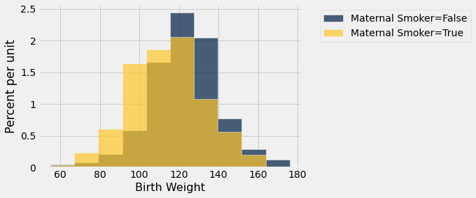

```python
from datascience import *
import numpy as np

%matplotlib inline
import matplotlib.pyplot as plots
plots.style.use('fivethirtyeight')
```

# Comparing Two Samples


```python
births = Table.read_table('baby.csv')
```


```python
births
```


<table border="1" class="dataframe">
    <thead>
        <tr>
            <th>Birth Weight</th> <th>Gestational Days</th> <th>Maternal Age</th> <th>Maternal Height</th> <th>Maternal Pregnancy Weight</th> <th>Maternal Smoker</th>
        </tr>
    </thead>
    <tbody>
        <tr>
            <td>120         </td> <td>284             </td> <td>27          </td> <td>62             </td> <td>100                      </td> <td>False          </td>
        </tr>
        <tr>
            <td>113         </td> <td>282             </td> <td>33          </td> <td>64             </td> <td>135                      </td> <td>False          </td>
        </tr>
        <tr>
            <td>128         </td> <td>279             </td> <td>28          </td> <td>64             </td> <td>115                      </td> <td>True           </td>
        </tr>
        <tr>
            <td>108         </td> <td>282             </td> <td>23          </td> <td>67             </td> <td>125                      </td> <td>True           </td>
        </tr>
        <tr>
            <td>136         </td> <td>286             </td> <td>25          </td> <td>62             </td> <td>93                       </td> <td>False          </td>
        </tr>
        <tr>
            <td>138         </td> <td>244             </td> <td>33          </td> <td>62             </td> <td>178                      </td> <td>False          </td>
        </tr>
        <tr>
            <td>132         </td> <td>245             </td> <td>23          </td> <td>65             </td> <td>140                      </td> <td>False          </td>
        </tr>
        <tr>
            <td>120         </td> <td>289             </td> <td>25          </td> <td>62             </td> <td>125                      </td> <td>False          </td>
        </tr>
        <tr>
            <td>143         </td> <td>299             </td> <td>30          </td> <td>66             </td> <td>136                      </td> <td>True           </td>
        </tr>
        <tr>
            <td>140         </td> <td>351             </td> <td>27          </td> <td>68             </td> <td>120                      </td> <td>False          </td>
        </tr>
    </tbody>
</table>
<p>... (1164 rows omitted)</p>


```python
smoking_and_birthweight = births.select('Maternal Smoker', 'Birth Weight')
```


```python
smoking_and_birthweight.group('Maternal Smoker')
```


<table border="1" class="dataframe">
    <thead>
        <tr>
            <th>Maternal Smoker</th> <th>count</th>
        </tr>
    </thead>
    <tbody>
        <tr>
            <td>False          </td> <td>715  </td>
        </tr>
        <tr>
            <td>True           </td> <td>459  </td>
        </tr>
    </tbody>
</table>


```python
smoking_and_birthweight.hist('Birth Weight', group='Maternal Smoker')
```


    

    


# Test Statistic

[Question] What values of our statistic are in favor of the alternative: positive or negative?


```python
means_table = smoking_and_birthweight.group('Maternal Smoker', np.average)
means_table
```


<table border="1" class="dataframe">
    <thead>
        <tr>
            <th>Maternal Smoker</th> <th>Birth Weight average</th>
        </tr>
    </thead>
    <tbody>
        <tr>
            <td>False          </td> <td>123.085             </td>
        </tr>
        <tr>
            <td>True           </td> <td>113.819             </td>
        </tr>
    </tbody>
</table>


```python
means = means_table.column(1)
observed_difference = means.item(1) - means.item(0)
observed_difference
```


    -9.266142572024918


```python
def difference_of_means(table, label, group_label):
    """Takes: name of table, column label of numerical variable,
    column label of group-label variable
    Returns: Difference of means of the two groups"""
    
    #table with the two relevant columns
    reduced = table.select(label, group_label)  
    
    # table containing group means
    means_table = reduced.group(group_label, np.average)
    # array of group means
    means = means_table.column(1)
    
    return means.item(1) - means.item(0)
```


```python
difference_of_means(births, 'Birth Weight', 'Maternal Smoker')
```


    -9.266142572024918


# Random Permutation (Shuffling)


```python
staff = Table().with_columns(
    'Names', make_array('Michael', 'Nihal', 'Simone', 'Keyao'),
    'Ages', make_array(29, 28, 34, 41)
)
```


```python
staff
```


<table border="1" class="dataframe">
    <thead>
        <tr>
            <th>Names</th> <th>Ages</th>
        </tr>
    </thead>
    <tbody>
        <tr>
            <td>Michael</td> <td>29  </td>
        </tr>
        <tr>
            <td>Nihal  </td> <td>28  </td>
        </tr>
        <tr>
            <td>Simone </td> <td>34  </td>
        </tr>
        <tr>
            <td>Keyao  </td> <td>41  </td>
        </tr>
    </tbody>
</table>


```python
staff.sample()
```


<table border="1" class="dataframe">
    <thead>
        <tr>
            <th>Names</th> <th>Ages</th>
        </tr>
    </thead>
    <tbody>
        <tr>
            <td>Keyao  </td> <td>41  </td>
        </tr>
        <tr>
            <td>Simone </td> <td>34  </td>
        </tr>
        <tr>
            <td>Simone </td> <td>34  </td>
        </tr>
        <tr>
            <td>Michael</td> <td>29  </td>
        </tr>
    </tbody>
</table>


```python
staff.sample(with_replacement = False)
```


<table border="1" class="dataframe">
    <thead>
        <tr>
            <th>Names</th> <th>Ages</th>
        </tr>
    </thead>
    <tbody>
        <tr>
            <td>Nihal  </td> <td>28  </td>
        </tr>
        <tr>
            <td>Michael</td> <td>29  </td>
        </tr>
        <tr>
            <td>Keyao  </td> <td>41  </td>
        </tr>
        <tr>
            <td>Simone </td> <td>34  </td>
        </tr>
    </tbody>
</table>


```python
staff.with_column('Shuffled', staff.sample(with_replacement = False).column(0))
```


<table border="1" class="dataframe">
    <thead>
        <tr>
            <th>Names</th> <th>Ages</th> <th>Shuffled</th>
        </tr>
    </thead>
    <tbody>
        <tr>
            <td>Michael</td> <td>29  </td> <td>Nihal   </td>
        </tr>
        <tr>
            <td>Nihal  </td> <td>28  </td> <td>Keyao   </td>
        </tr>
        <tr>
            <td>Simone </td> <td>34  </td> <td>Simone  </td>
        </tr>
        <tr>
            <td>Keyao  </td> <td>41  </td> <td>Michael </td>
        </tr>
    </tbody>
</table>


# Simulation Under Null Hypothesis


```python
smoking_and_birthweight
```


<table border="1" class="dataframe">
    <thead>
        <tr>
            <th>Maternal Smoker</th> <th>Birth Weight</th>
        </tr>
    </thead>
    <tbody>
        <tr>
            <td>False          </td> <td>120         </td>
        </tr>
        <tr>
            <td>False          </td> <td>113         </td>
        </tr>
        <tr>
            <td>True           </td> <td>128         </td>
        </tr>
        <tr>
            <td>True           </td> <td>108         </td>
        </tr>
        <tr>
            <td>False          </td> <td>136         </td>
        </tr>
        <tr>
            <td>False          </td> <td>138         </td>
        </tr>
        <tr>
            <td>False          </td> <td>132         </td>
        </tr>
        <tr>
            <td>False          </td> <td>120         </td>
        </tr>
        <tr>
            <td>True           </td> <td>143         </td>
        </tr>
        <tr>
            <td>False          </td> <td>140         </td>
        </tr>
    </tbody>
</table>
<p>... (1164 rows omitted)</p>


```python
# Step 1: Shuffle the table and take out the Maternal Smoker column
shuffled_labels = smoking_and_birthweight.sample(with_replacement=False
                                                ).column('Maternal Smoker')
```


```python
shuffled_labels
```


    array([ True, False, False, ...,  True,  True, False])


```python
# Step 2: add the shuffled smoker column to the original table
original_and_shuffled = smoking_and_birthweight.with_column(
    'Shuffled Label', shuffled_labels
)
```


```python
original_and_shuffled
```


<table border="1" class="dataframe">
    <thead>
        <tr>
            <th>Maternal Smoker</th> <th>Birth Weight</th> <th>Shuffled Label</th>
        </tr>
    </thead>
    <tbody>
        <tr>
            <td>False          </td> <td>120         </td> <td>True          </td>
        </tr>
        <tr>
            <td>False          </td> <td>113         </td> <td>False         </td>
        </tr>
        <tr>
            <td>True           </td> <td>128         </td> <td>False         </td>
        </tr>
        <tr>
            <td>True           </td> <td>108         </td> <td>True          </td>
        </tr>
        <tr>
            <td>False          </td> <td>136         </td> <td>False         </td>
        </tr>
        <tr>
            <td>False          </td> <td>138         </td> <td>False         </td>
        </tr>
        <tr>
            <td>False          </td> <td>132         </td> <td>True          </td>
        </tr>
        <tr>
            <td>False          </td> <td>120         </td> <td>False         </td>
        </tr>
        <tr>
            <td>True           </td> <td>143         </td> <td>True          </td>
        </tr>
        <tr>
            <td>False          </td> <td>140         </td> <td>True          </td>
        </tr>
    </tbody>
</table>
<p>... (1164 rows omitted)</p>


```python
difference_of_means(original_and_shuffled, 'Birth Weight', 'Shuffled Label')
```


    -0.15846245258009617


```python
difference_of_means(original_and_shuffled, 'Birth Weight', 'Maternal Smoker')
```


    -9.266142572024918


# Permutation Test


```python
def one_simulated_difference(table, label, group_label):
    """Takes: name of table, column label of numerical variable,
    column label of group-label variable
    Returns: Difference of means of the two groups after shuffling labels"""
    
    # array of shuffled labels
    shuffled_labels = table.sample(with_replacement = False
                                                    ).column(group_label)
    
    # table of numerical variable and shuffled labels
    shuffled_table = table.select(label).with_column(
        'Shuffled Label', shuffled_labels)
    
    return difference_of_means(shuffled_table, label, 'Shuffled Label')   
```


```python
one_simulated_difference(births, 'Birth Weight', 'Maternal Smoker')
```


    -2.3441625912214192


```python
differences = make_array()

for i in np.arange(2500):
    new_difference = one_simulated_difference(births, 'Birth Weight', 'Maternal Smoker')
    differences = np.append(differences, new_difference)
```


```python
Table().with_column('Difference Between Group Means', differences).hist()
print('Observed Difference:', observed_difference)
plots.title('Prediction Under the Null Hypothesis');
```

    Observed Difference: -9.266142572024918


    

    


```python
# p-value
np.count_nonzero(differences < observed_difference)/2500
```


    0.0


