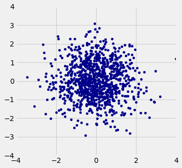
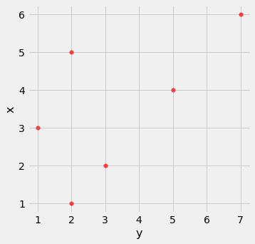

## Lecture 10 ##


```python
import matplotlib
from datascience import *
%matplotlib inline
import matplotlib.pyplot as plots
import numpy as np
plots.style.use('fivethirtyeight')
```


```python
def r_scatter(r):
    plots.figure(figsize=(5,5))
    "Generate a scatter plot with a correlation approximately r"
    x = np.random.normal(0, 1, 1000)
    z = np.random.normal(0, 1, 1000)
    y = r*x + (np.sqrt(1-r**2))*z
    plots.scatter(x, y, color='darkblue', s=20)
    plots.xlim(-4, 4)
    plots.ylim(-4, 4)
```


```python
r_scatter(0)
```


    

    


## Standard Units ##


```python
def standard_units(x):
    """Convert array x to standard units."""
    return (x - np.mean(x)) / np.std(x)
```

## Central Limit Theorem ##

We will work with the flight delays dataset again (flight delays for United flights in summer 2015).


```python
united = Table.read_table('united.csv')
united_bins = np.arange(-20, 300, 10)
united
```


<table border="1" class="dataframe">
    <thead>
        <tr>
            <th>Date</th> <th>Flight Number</th> <th>Destination</th> <th>Delay</th>
        </tr>
    </thead>
    <tbody>
        <tr>
            <td>6/1/15</td> <td>73           </td> <td>HNL        </td> <td>257  </td>
        </tr>
        <tr>
            <td>6/1/15</td> <td>217          </td> <td>EWR        </td> <td>28   </td>
        </tr>
        <tr>
            <td>6/1/15</td> <td>237          </td> <td>STL        </td> <td>-3   </td>
        </tr>
        <tr>
            <td>6/1/15</td> <td>250          </td> <td>SAN        </td> <td>0    </td>
        </tr>
        <tr>
            <td>6/1/15</td> <td>267          </td> <td>PHL        </td> <td>64   </td>
        </tr>
        <tr>
            <td>6/1/15</td> <td>273          </td> <td>SEA        </td> <td>-6   </td>
        </tr>
        <tr>
            <td>6/1/15</td> <td>278          </td> <td>SEA        </td> <td>-8   </td>
        </tr>
        <tr>
            <td>6/1/15</td> <td>292          </td> <td>EWR        </td> <td>12   </td>
        </tr>
        <tr>
            <td>6/1/15</td> <td>300          </td> <td>HNL        </td> <td>20   </td>
        </tr>
        <tr>
            <td>6/1/15</td> <td>317          </td> <td>IND        </td> <td>-10  </td>
        </tr>
    </tbody>
</table>
<p>... (13815 rows omitted)</p>


```python
united.hist('Delay', bins=united_bins)
```


    

    


```python
delays = united.column('Delay')
delay_mean = np.mean(delays)
delay_sd = np.std(delays)
delay_mean, delay_sd
```


    (16.658155515370705, 39.480199851609314)


```python
percentile(50, delays)
```


    2


```python
def one_sample_mean(sample_size):
    """ 
    Takes a sample from the population of flights 
    and computes its mean
    """
    sampled_flights = united.sample(sample_size)
    return np.mean(sampled_flights.column('Delay'))
```


```python
one_sample_mean(100)
```


    22.79


```python
def ten_thousand_sample_means(sample_size):
    means = make_array()
    for i in np.arange(10000):
        mean = one_sample_mean(sample_size)
        means = np.append(means, mean)
    return means
```


```python
sample_means_100 = ten_thousand_sample_means(100)
```


```python
sample_means_100
```


    array([15.31, 14.5 , 21.84, ..., 18.84, 15.14, 18.55])


```python
len(sample_means_100)
```


    10000


```python
Table().with_column(
    'Mean of 100 flight delays', sample_means_100).hist(bins=20)

print('Population Average:', delay_mean)
```

    Population Average: 16.658155515370705


    

    


```python
sample_means_400 = ten_thousand_sample_means(400)
Table().with_column(
    'Mean of 400 flight delays', sample_means_400).hist(bins=20)

print('Population Average:', delay_mean)
```

    Population Average: 16.658155515370705


    

    


```python
"""Empirical distribution of random sample means"""

def plot_sample_means(sample_size):
    means = ten_thousand_sample_means(sample_size)
    sample_means = Table().with_column('Sample Means', means)
    
    # Display empirical histogram and print all relevant quantities
    sample_means.hist(bins=20)
    plots.xlabel('Sample Means')
    plots.title('Sample Size ' + str(sample_size))
    print("Sample size: ", sample_size)
    print("Population mean:", np.mean(united.column('Delay')))
    print("Average of sample means: ", np.mean(means))
    print("Population SD:", np.std(united.column('Delay')))
    print("SD of sample means:", np.std(means))
```


```python
plot_sample_means(100)
```

    Sample size:  100
    Population mean: 16.658155515370705
    Average of sample means:  16.629687999999998
    Population SD: 39.480199851609314
    SD of sample means: 3.8876785338625934


    

    


```python
plot_sample_means(400)
```

    Sample size:  400
    Population mean: 16.658155515370705
    Average of sample means:  16.6420715
    Population SD: 39.480199851609314
    SD of sample means: 1.9368064720404436


    

    


```python
plot_sample_means(900)
```

    Sample size:  900
    Population mean: 16.658155515370705
    Average of sample means:  16.673920888888887
    Population SD: 39.480199851609314
    SD of sample means: 1.3261662746849667


    

    


## SD of the sample mean

How would you interpret the above pictures?  What does it tell you about the effect of increasing the sample size?


```python
# Warning: this cell will take a long time to run
sample_sizes = np.arange(100, 950, 50)

sample_mean_sds = make_array()
for n in sample_sizes:
    sample_means = ten_thousand_sample_means(n)
    sample_mean_sds = np.append(sample_mean_sds, np.std(sample_means))
```


```python
sd_table = Table().with_columns(
    'Sample size', sample_sizes,
    'SD of simulated sample means', sample_mean_sds,
    'Pop SD / sqrt(sample size)', population_sd / np.sqrt(sample_sizes),
)
sd_table
```


<table border="1" class="dataframe">
    <thead>
        <tr>
            <th>Sample size</th> <th>SD of simulated sample means</th> <th>Pop SD / sqrt(sample size)</th>
        </tr>
    </thead>
    <tbody>
        <tr>
            <td>100        </td> <td>3.94299                     </td> <td>3.94802                   </td>
        </tr>
        <tr>
            <td>150        </td> <td>3.17881                     </td> <td>3.22354                   </td>
        </tr>
        <tr>
            <td>200        </td> <td>2.76894                     </td> <td>2.79167                   </td>
        </tr>
        <tr>
            <td>250        </td> <td>2.51768                     </td> <td>2.49695                   </td>
        </tr>
        <tr>
            <td>300        </td> <td>2.29737                     </td> <td>2.27939                   </td>
        </tr>
        <tr>
            <td>350        </td> <td>2.10811                     </td> <td>2.11031                   </td>
        </tr>
        <tr>
            <td>400        </td> <td>1.9923                      </td> <td>1.97401                   </td>
        </tr>
        <tr>
            <td>450        </td> <td>1.85335                     </td> <td>1.86111                   </td>
        </tr>
        <tr>
            <td>500        </td> <td>1.76439                     </td> <td>1.76561                   </td>
        </tr>
        <tr>
            <td>550        </td> <td>1.69428                     </td> <td>1.68344                   </td>
        </tr>
    </tbody>
</table>
<p>... (7 rows omitted)</p>


```python
sd_table.scatter('Sample size')
```


    

    


## Correlation ##


```python
r_scatter(0)
```


    

    


```python

```


```python

```

## Calculating $r$ ##


```python
x = np.arange(1, 7, 1)
y = make_array(2, 3, 1, 5, 2, 7)
t = Table().with_columns(
        'x', x,
        'y', y
    )
t
```


<table border="1" class="dataframe">
    <thead>
        <tr>
            <th>x</th> <th>y</th>
        </tr>
    </thead>
    <tbody>
        <tr>
            <td>1   </td> <td>2   </td>
        </tr>
        <tr>
            <td>2   </td> <td>3   </td>
        </tr>
        <tr>
            <td>3   </td> <td>1   </td>
        </tr>
        <tr>
            <td>4   </td> <td>5   </td>
        </tr>
        <tr>
            <td>5   </td> <td>2   </td>
        </tr>
        <tr>
            <td>6   </td> <td>7   </td>
        </tr>
    </tbody>
</table>


```python
t.scatter('x', 'y', s=30, color='red')
```


    

    


```python
t = t.with_columns(
        'x (standard units)', standard_units(x),
        'y (standard units)', standard_units(y)
    )
t
```


<table border="1" class="dataframe">
    <thead>
        <tr>
            <th>x</th> <th>y</th> <th>x (standard units)</th> <th>y (standard units)</th>
        </tr>
    </thead>
    <tbody>
        <tr>
            <td>1   </td> <td>2   </td> <td>-1.46385          </td> <td>-0.648886         </td>
        </tr>
        <tr>
            <td>2   </td> <td>3   </td> <td>-0.87831          </td> <td>-0.162221         </td>
        </tr>
        <tr>
            <td>3   </td> <td>1   </td> <td>-0.29277          </td> <td>-1.13555          </td>
        </tr>
        <tr>
            <td>4   </td> <td>5   </td> <td>0.29277           </td> <td>0.811107          </td>
        </tr>
        <tr>
            <td>5   </td> <td>2   </td> <td>0.87831           </td> <td>-0.648886         </td>
        </tr>
        <tr>
            <td>6   </td> <td>7   </td> <td>1.46385           </td> <td>1.78444           </td>
        </tr>
    </tbody>
</table>


```python
t.scatter(2, 3)
```


    

    


```python
t = t.with_columns('product of standard units', t.column(2) * t.column(3))
t
```


<table border="1" class="dataframe">
    <thead>
        <tr>
            <th>x</th> <th>y</th> <th>x (standard units)</th> <th>y (standard units)</th> <th>product of standard units</th>
        </tr>
    </thead>
    <tbody>
        <tr>
            <td>1   </td> <td>2   </td> <td>-1.46385          </td> <td>-0.648886         </td> <td>0.949871                 </td>
        </tr>
        <tr>
            <td>2   </td> <td>3   </td> <td>-0.87831          </td> <td>-0.162221         </td> <td>0.142481                 </td>
        </tr>
        <tr>
            <td>3   </td> <td>1   </td> <td>-0.29277          </td> <td>-1.13555          </td> <td>0.332455                 </td>
        </tr>
        <tr>
            <td>4   </td> <td>5   </td> <td>0.29277           </td> <td>0.811107          </td> <td>0.237468                 </td>
        </tr>
        <tr>
            <td>5   </td> <td>2   </td> <td>0.87831           </td> <td>-0.648886         </td> <td>-0.569923                </td>
        </tr>
        <tr>
            <td>6   </td> <td>7   </td> <td>1.46385           </td> <td>1.78444           </td> <td>2.61215                  </td>
        </tr>
    </tbody>
</table>


```python
# r is the average of the products of the standard units

r = np.average(t.column(2) * t.column(3))
r
```


    0.6174163971897709


```python
def correlation(t, x, y):
    """t is a table; x and y are column labels"""
    x_in_standard_units = standard_units(t.column(x))
    y_in_standard_units = standard_units(t.column(y))
    return np.average(x_in_standard_units * y_in_standard_units)
```


```python
correlation(t, 'x', 'y')
```


    0.6174163971897709


### Switching Axes ###


```python
correlation(t, 'x', 'y')
```


    0.6174163971897709


```python
t.scatter('x', 'y', s=30, color='red')
```


    

    


```python
t.scatter('y', 'x', s=30, color='red')
```


    

    


```python
correlation(t, 'y', 'x')
```


    0.6174163971897709


### Nonlinearity ###


```python
new_x = np.arange(-4, 4.1, 0.5)
nonlinear = Table().with_columns(
        'x', new_x,
        'y', new_x**2
    )
nonlinear.scatter('x', 'y', s=30, color='r')
```


    

    


```python
correlation(nonlinear, 'x', 'y')
```


    0.0


### Outliers ###


```python
line = Table().with_columns(
        'x', make_array(1, 2, 3, 4),
        'y', make_array(1, 2, 3, 4)
    )
line.scatter('x', 'y', s=30, color='r')
```


    

    


```python
correlation(line, 'x', 'y')
```


    1.0


```python
outlier = Table().with_columns(
        'x', make_array(1, 2, 3, 4, 5),
        'y', make_array(1, 2, 3, 4, 0)
    )
outlier.scatter('x', 'y', s=30, color='r')
```


    

    


```python
correlation(outlier, 'x', 'y')
```


    0.0


```python

```
