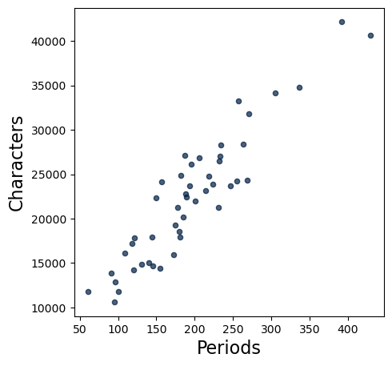

# Homework 1: Expressions, Arrays and Tables

Please complete this notebook by filling in the cells provided. Before you begin, execute the following cell to load the provided tests.

**Recommended Reading:**
- [What is Data Science](http://www.inferentialthinking.com/chapters/01/what-is-data-science.html)
- [Programming in Python](http://www.inferentialthinking.com/chapters/03/programming-in-python.html)
- [Data Types](https://inferentialthinking.com/chapters/04/Data_Types.html)
- [Sequences](https://inferentialthinking.com/chapters/05/Sequences.html)

For all problems that you must write explanations and sentences for, you **must** provide your answer in the designated space. Moreover, throughout this homework and all future ones, please be sure to not re-assign variables throughout the notebook. For example, if you use `max_temperature` in your answer to one question, do not reassign it later on. 

**Deadline:**

This assignment is due on January 20 (Friday), 2023 at 23:59

Directly sharing answers is not okay, but discussing problems with the course staff or with other students is encouraged. Refer to the policies page to learn more about how to learn cooperatively.

You should start early so that you have time to get help if you're stuck. 

## 1. Characters in Little Women


In lecture, we counted the number of times that the literary characters were named in each chapter of the classic book, [*Little Women*](https://www.inferentialthinking.com/chapters/01/3/1/literary-characters). In computer science, the word "character" also refers to a letter, digit, space, or punctuation mark; any single element of a text. The following code generates a scatter plot in which each dot corresponds to a chapter of *Little Women*. The horizontal position of a dot measures the number of periods in the chapter. The vertical position measures the total number of characters.


```python
# This cell contains code that hasn't yet been covered in the course,
# but you should be able to interpret the scatter plot it generates.

from datascience import *
from urllib.request import urlopen
import numpy as np
%matplotlib inline

little_women_url = 'https://www.inferentialthinking.com/data/little_women.txt'
chapters = urlopen(little_women_url).read().decode().split('CHAPTER ')[1:]
text = Table().with_column('Chapters', chapters)
Table().with_columns(
    'Periods',    np.char.count(chapters, '.'),
    'Characters', text.apply(len, 0)
    ).scatter(0)
```


    

    


**Question 1.** Around how many periods are there in the chapter with the most characters? Assign either 1, 2, 3, 4, or 5 to the name `characters_q1` below.

1. 250
2. 390
3. 440
4. 32,000
5. 40,000

<!--
BEGIN QUESTION
name: q2_1
manual: false
-->


```python
characters_q1 = 2
```

**Question 2.** Which of the following chapters has the most characters per period? Assign either 1, 2, or 3 to the name `characters_q2` below.
1. The chapter with about 60 periods
2. The chapter with about 350 periods
3. The chapter with about 440 periods

<!--
BEGIN QUESTION
name: q2_2
manual: false
-->


```python
characters_q2 = 1
```

## 2. Names and Assignment Statements


**Question 1.** When you run the following cell, Python produces a cryptic error message.


```python
4 = 2 + 2
```


      Cell In[8], line 1
        4 = 2 + 2
        ^
    SyntaxError: cannot assign to literal here. Maybe you meant '==' instead of '='?


Choose the best explanation of what's wrong with the code, and then assign 1, 2, 3, or 4 to `names_q1` below to indicate your answer.

1. Python is smart and already knows `4 = 2 + 2`.

2. `4` is already a defined number, and it doesn't make sense to make a number be a name for something else. In Python, "`x = 2 + 2`" means "assign `x` as the name for the value of `2 + 2`."

3. It should be `2 + 2 = 4`.

4. I don't get an error message. This is a trick question.

<!--
BEGIN QUESTION
name: q3_1
manual: False
-->


```python
names_q1 = 2
```

**Question 2.** When you run the following cell, Python will produce another cryptic error message.


```python
two = 3
six = two plus two
```

Choose the best explanation of what's wrong with the code and assign 1, 2, 3, or 4 to `names_q2` below to indicate your answer.

1. The `plus` operation only applies to numbers, not the word "two".

2. The name "two" cannot be assigned to the number 3.

3. Two plus two is four, not six.

4. Python cannot interpret the name `two` followed directly by a name that has not been defined.

<!--
BEGIN QUESTION
name: q3_2
manual: False
-->


```python
names_q2 = 4
```

**Question 3.** When you run the following cell, Python will, yet again, produce another cryptic error message.


```python
x = print(5)
y = x + 2
```

    5


    ---------------------------------------------------------------------------

    TypeError                                 Traceback (most recent call last)

    Cell In[9], line 2
          1 x = print(5)
    ----> 2 y = x + 2


    TypeError: unsupported operand type(s) for +: 'NoneType' and 'int'


Choose the best explanation of what's wrong with the code and assign 1, 2, or 3 to `names_q3` below to indicate your answer.

1. Python doesn't want `y` to be assigned.

2. The `print` operation is meant for displaying values to the programmer, not for assigning values!

3. Python can’t do addition between one name and one number. It has to be 2 numbers or 2 predefined names.

<!--
BEGIN QUESTION
name: q3_3
manual: false
-->


```python
names_q3 = 2
```

## 3. Differences between Majors


The following table below displays the hypothetical numbers of degree recipients in three majors in the academic years 2018-2019 and 2019-2020.

| Major                              | 2018-2019    | 2019-2020   |
|------------------------------------|--------------|-------------|
| Environmental Studies         |      17      |    28       |
| MCS                        |      49      |    67       |
| Physical Sciences                           |      113     |    56       |


**Question 1.** Suppose you want to find the **biggest** absolute difference between the numbers of degree recipients in the two years, among the three majors.

In the cell below, compute this value and call it `biggest_change`. Use a single expression (a single line of code) to compute the answer. Let Python perform all the arithmetic (like subtracting 49 from 67) rather than simplifying the expression yourself. The built-in `abs` function takes a numerical input and returns the absolute value. The built-in `max` function can take in 3 arguments and returns the maximum of the three numbers

<!--
BEGIN QUESTION
name: q5_1
manual: True
-->
<!-- EXPORT TO PDF -->


```python
biggest_change = max(abs(28-17), abs(67-49), abs(56-113))
biggest_change
```


    11


**Question 2.** Which of the three majors had the **smallest** absolute difference? Assign `smallest_change_major` to 1, 2, or 3 where each number corresponds to the following major:

1: Environmental Studies  
2: MCS  
3: Physical Sciences

Choose the number that corresponds to the major with the smallest absolute difference.

You should be able to answer by rough mental arithmetic, without having to calculate the exact value for each major. 

<!--
BEGIN QUESTION
name: q5_2
manual: False
-->


```python
smallest_change_major = 1
smallest_change_major
```

**Question 3.**  For each major, define the “relative change” to be the following: $\large{\frac{\text{absolute difference}}{\text{value in 2018-2019}} * 100}$ 

Fill in the code below such that `es_relative_change`, `mcs_relative_change` and `ps_relative_change` are assigned to the relative changes for their respective majors.

<!--
BEGIN QUESTION
name: q5_3
manual: False
-->


```python
es_relative_change = (abs(28-17)/17) * 100
mcs_relative_change = (abs(67-49)/49) * 100
ps_relative_change = (abs(56-113)/113) * 100
es_relative_change, mcs_relative_change, ps_relative_change
```


    (64.70588235294117, 36.734693877551024, 50.442477876106196)


**Question 4.** Assign `biggest_rel_change_major` to 1, 2, or 3 where each number corresponds to to the following: 

1: Environmental Studies  
2: MCS  
3: Physical Sciences

Choose the number that corresponds to the major with the biggest relative change.


```python
# Assign biggest_rel_change_major to the number corresponding to the major with the biggest relative change.
biggest_rel_change_major = 1
biggest_rel_change_major
```

## 4. Creating Arrays


**Question 1.** Make an array called `weird_numbers` containing the following numbers (in the given order):

1. -2
2. the sine of 12
3. 3
4. 5 to the power of the cosine of 12

*Hint:* `sin` and `cos` are functions in the `math` module. Importing modules is covered in 2.1 of Lab 2!

*Note:* Python lists are different/behave differently than numpy arrays. In this course, we use numpy arrays, so please make an **array**, not a python list.

<!--
BEGIN QUESTION
name: q1_1
-->


```python
# Our solution involved one extra line of code before creating
# weird_numbers.
import math
weird_numbers = make_array(-2, math.sin(12), 3, 5**math.cos(12))
weird_numbers
```


    array([-2.        , -0.53657292,  3.        ,  3.88891638])


**Question 2.** Make an array called `book_title_words` containing the following three strings: "Eats", "Shoots", and "and Leaves".

<!--
BEGIN QUESTION
name: q1_2
-->


```python
book_title_words = make_array('Eats', 'Shoots', 'and Leaves')
book_title_words
```


    array(['Eats', 'Shoots', 'and Leaves'],
          dtype='<U10')


Strings have a method called `join`.  `join` takes one argument, an array of strings.  It returns a single string.  Specifically, the value of `a_string.join(an_array)` is a single string that's the [concatenation](https://en.wikipedia.org/wiki/Concatenation) ("putting together") of all the strings in `an_array`, **except** `a_string` is inserted in between each string.

**Question 3.** Use the array `book_title_words` and the method `join` to make two strings:

1. "Eats, Shoots, and Leaves" (call this one `with_commas`)
2. "Eats Shoots and Leaves" (call this one `without_commas`)

*Hint:* If you're not sure what `join` does, first try just calling, for example, `"foo".join(book_title_words)` .

<!--
BEGIN QUESTION
name: q1_3
-->


```python
with_commas = ", ".join(book_title_words)
without_commas = " ".join(book_title_words)

# These lines are provided just to print out your answers.
print('with_commas:', with_commas)
print('without_commas:', without_commas)
```

    with_commas: Eats, Shoots, and Leaves
    without_commas: Eats Shoots and Leaves


## 5. Indexing Arrays


These exercises give you practice accessing individual elements of arrays.  In Python (and in many programming languages), elements are accessed by *index*, so the first element is the element at index 0.

Be sure to refer to the [Python Reference](http://data8.org/fa20/python-reference.html) if you are stuck.

**Question 1.** The cell below creates an array of some numbers.  Set `third_element` to the third element of `some_numbers`.

<!--
BEGIN QUESTION
name: q2_1
-->


```python
some_numbers = make_array(-1, -3, -6, -10, -15)

third_element = some_numbers[2]
third_element
```


    -6


**Question 2.** The next cell creates a table that displays some information about the elements of `some_numbers` and their order.  Run the cell to see the partially-completed table, then fill in the missing information (the cells that say "Ellipsis") by assigning `blank_a`, `blank_b`, `blank_c`, and `blank_d` to the correct elements in the table.

Hint: Replace the … with strings or numbers.

<!--
BEGIN QUESTION
name: q2_2
-->


```python
blank_a = "third"
blank_b = "fourth"
blank_c = 0
blank_d = 3
elements_of_some_numbers = Table().with_columns(
    "English name for position", make_array("first", "second", blank_a, blank_b, "fifth"),
    "Index",                     make_array(blank_c, 1, 2, blank_d, 4),
    "Element",                   some_numbers)
elements_of_some_numbers
```


<table border="1" class="dataframe">
    <thead>
        <tr>
            <th>English name for position</th> <th>Index</th> <th>Element</th>
        </tr>
    </thead>
    <tbody>
        <tr>
            <td>first                    </td> <td>0    </td> <td>-1     </td>
        </tr>
        <tr>
            <td>second                   </td> <td>1    </td> <td>-3     </td>
        </tr>
        <tr>
            <td>third                    </td> <td>2    </td> <td>-6     </td>
        </tr>
        <tr>
            <td>fourth                   </td> <td>3    </td> <td>-10    </td>
        </tr>
        <tr>
            <td>fifth                    </td> <td>4    </td> <td>-15    </td>
        </tr>
    </tbody>
</table>


**Question 3.** You'll sometimes want to find the *last* element of an array.  Suppose an array has 142 elements.  What is the index of its last element?

<!--
BEGIN QUESTION
name: q2_3
-->


```python
index_of_last_element = 141
index_of_last_element
```


    -15


More often, you don't know the number of elements in an array, its *length*.  (For example, it might be a large dataset you found on the Internet.)  The function `len` takes a single argument, an array, and returns the `len`gth of that array (an integer).

**Question 4.** The cell below loads an array called `president_birth_years`.  Calling `.column(...)` on a table returns an array of the column specified, in this case the `Birth Year` column of the `president_births` table. The last element in that array is the most recent birth year of any deceased president. Assign that year to `most_recent_birth_year`.

<!--
BEGIN QUESTION
name: q2_4
-->


```python
president_birth_years = Table.read_table("president_births.csv").column('Birth Year')

most_recent_birth_year = president_birth_years[-1]
most_recent_birth_year
```


    1917


**Question 5.** Finally, assign `sum_of_birth_years` to the sum of the first, sixteenth, and last birth year in `president_birth_years`.

<!--
BEGIN QUESTION
name: q2_5
-->


```python
sum_of_birth_years = president_birth_years[0] + president_birth_years[15] + president_birth_years[-1]
sum_of_birth_years
```


    5457


## 6. Basic Array Arithmetic


**Question 1.** Multiply the numbers 42, -4224, 424224242, and 250 by 157. Assign each variable below such that `first_product` is assigned to the result of $42 * 157$, `second_product` is assigned to the result of $-4224 * 157$, and so on. 

For this question, **don't** use arrays.

<!--
BEGIN QUESTION
name: q3_1
-->


```python
first_product = 42 * 157
second_product = -4224 * 157
third_product = 424224242 * 157
fourth_product = 250 * 157
print(first_product, second_product, third_product, fourth_product)
```

**Question 2.** Now, do the same calculation, but using an array called `numbers` and only a single multiplication (`*`) operator.  Store the 4 results in an array named `products`.

<!--
BEGIN QUESTION
name: q3_2
-->


```python
numbers = make_array(42, -4224, 424224242, 250)
products = numbers * 157
products
```


    array([       6594,     -663168, 66603205994,       39250])


**Question 3.** Oops, we made a typo!  Instead of 157, we wanted to multiply each number by 1577.  Compute the correct products in the cell below using array arithmetic.  Notice that your job is really easy if you previously defined an array containing the 4 numbers.

<!--
BEGIN QUESTION
name: q3_3
-->


```python
correct_products = numbers*1577
correct_products
```


    array([       66234,     -6661248, 669001629634,       394250])


**Question 4.** We've loaded an array of temperatures in the next cell.  Each number is the highest temperature observed on a day at a climate observation station, mostly from the US.  Since they're from the US government agency [NOAA](noaa.gov), all the temperatures are in Fahrenheit.  Convert them all to Celsius by first subtracting 32 from them, then multiplying the results by $\frac{5}{9}$. Make sure to **ROUND** the final result after converting to Celsius to the nearest integer using the `np.round` function.

<!--
BEGIN QUESTION
name: q3_4
-->


```python
max_temperatures = Table.read_table("temperatures.csv").column("Daily Max Temperature")

celsius_max_temperatures = np.round((max_temperatures-32)*(5/9))
celsius_max_temperatures
```


    array([ -4.,  31.,  32., ...,  17.,  23.,  16.])


**Question 5.** The cell below loads all the *lowest* temperatures from each day (in Fahrenheit).  Compute the size of the daily temperature range for each day.  That is, compute the difference between each daily maximum temperature and the corresponding daily minimum temperature.  **Pay attention to the units, give your answer in Celsius!** Make sure **NOT** to round your answer for this question! Note: Remember that in Question 4, `celsius_max_temperatures` was rounded, so you might not want to use that in this question.


<!--
BEGIN QUESTION
name: q3_5
-->


```python
min_temperatures = Table.read_table("temperatures.csv").column("Daily Min Temperature")

celsius_temperature_ranges = celsius_max_temperatures - (min_temperatures-32)*(5/9)
celsius_temperature_ranges
```


    array([  6.55555556,  10.44444444,  12.55555556, ...,  17.55555556,
            11.88888889,  11.        ])


## 7. World Population


The cell below loads a table of estimates of the world population for different years, starting in 1950. The estimates come from the [US Census Bureau website](https://www.census.gov/en.html).


```python
world = Table.read_table("world_population.csv").select('Year', 'Population')
world.show(4)
```


<table border="1" class="dataframe">
    <thead>
        <tr>
            <th>Year</th> <th>Population</th>
        </tr>
    </thead>
    <tbody>
        <tr>
            <td>1950</td> <td>2557628654</td>
        </tr>
        <tr>
            <td>1951</td> <td>2594939877</td>
        </tr>
        <tr>
            <td>1952</td> <td>2636772306</td>
        </tr>
        <tr>
            <td>1953</td> <td>2682053389</td>
        </tr>
    </tbody>
</table>
<p>... (62 rows omitted)</p>


The name `population` is assigned to an array of population estimates.


```python
population = world.column(1)
population
```


    array([2557628654, 2594939877, 2636772306, 2682053389, 2730228104,
           2782098943, 2835299673, 2891349717, 2948137248, 3000716593,
           3043001508, 3083966929, 3140093217, 3209827882, 3281201306,
           3350425793, 3420677923, 3490333715, 3562313822, 3637159050,
           3712697742, 3790326948, 3866568653, 3942096442, 4016608813,
           4089083233, 4160185010, 4232084578, 4304105753, 4379013942,
           4451362735, 4534410125, 4614566561, 4695736743, 4774569391,
           4856462699, 4940571232, 5027200492, 5114557167, 5201440110,
           5288955934, 5371585922, 5456136278, 5538268316, 5618682132,
           5699202985, 5779440593, 5857972543, 5935213248, 6012074922,
           6088571383, 6165219247, 6242016348, 6318590956, 6395699509,
           6473044732, 6551263534, 6629913759, 6709049780, 6788214394,
           6866332358, 6944055583, 7022349283, 7101027895, 7178722893,
           7256490011])


In this question, you will apply some built-in Numpy functions to this array. Numpy is a module that is often used in Data Science!


The difference function `np.diff` subtracts each element in an array from the element after it within the array. As a result, the length of the array `np.diff` returns will always be one less than the length of the input array.


The cumulative sum function `np.cumsum` outputs an array of partial sums. For example, the third element in the output array corresponds to the sum of the first, second, and third elements.

**Note:** This homework aims to get you comfortable with array arithmetic using methods like `np.diff` and `np.cumsum`, but they are not heavily used later in the course.

**Question 1.** Very often in data science, we are interested understanding how values change with time. Use `np.diff` and `np.max` (or just `max`) to calculate the largest annual change in population between any two consecutive years.

<!--
BEGIN QUESTION
name: q4_1
-->


```python
largest_population_change = max(abs(np.diff(population)))
largest_population_change
```


    87515824


**Question 2.** What do the values in the resulting array represent (choose one)?

*Tip: Look at the population array and compute the actual population changes for the first couple years of each option.* 


```python
np.cumsum(np.diff(population))
```


    array([  37311223,   79143652,  124424735,  172599450,  224470289,
            277671019,  333721063,  390508594,  443087939,  485372854,
            526338275,  582464563,  652199228,  723572652,  792797139,
            863049269,  932705061, 1004685168, 1079530396, 1155069088,
           1232698294, 1308939999, 1384467788, 1458980159, 1531454579,
           1602556356, 1674455924, 1746477099, 1821385288, 1893734081,
           1976781471, 2056937907, 2138108089, 2216940737, 2298834045,
           2382942578, 2469571838, 2556928513, 2643811456, 2731327280,
           2813957268, 2898507624, 2980639662, 3061053478, 3141574331,
           3221811939, 3300343889, 3377584594, 3454446268, 3530942729,
           3607590593, 3684387694, 3760962302, 3838070855, 3915416078,
           3993634880, 4072285105, 4151421126, 4230585740, 4308703704,
           4386426929, 4464720629, 4543399241, 4621094239, 4698861357])


1) The total population change between consecutive years, starting at 1951.

2) The total population change between 1950 and each later year, starting at 1951.

3) The total population change between 1950 and each later year, starting inclusively at 1950.

<!--
BEGIN QUESTION
name: q4_2
-->


```python
# Assign cumulative_sum_answer to 1, 2, or 3
cumulative_sum_answer = 2
```

## 8. Old Faithful


Old Faithful is a geyser in Yellowstone that erupts every 44 to 125 minutes (according to [Wikipedia](https://en.wikipedia.org/wiki/Old_Faithful)). People are [often told that the geyser erupts every hour](http://yellowstone.net/geysers/old-faithful/), but in fact the waiting time between eruptions is more variable. Let's take a look.

**Question 1.** The first line below assigns `waiting_times` to an array of 272 consecutive waiting times between eruptions, taken from a classic 1938 dataset. Assign the names `shortest`, `longest`, and `average` so that the `print` statement is correct.

<!--
BEGIN QUESTION
name: q5_1
-->


```python
waiting_times = Table.read_table('old_faithful.csv').column('waiting')

shortest = min(waiting_times)
longest = max(waiting_times)
average = sum(waiting_times)/len(waiting_times)

print("Old Faithful erupts every", shortest, "to", longest, "minutes and every", average, "minutes on average.")
```

    Old Faithful erupts every 43 to 96 minutes and every 70.8970588235 minutes on average.


**Question 2.** Assign `biggest_decrease` to the biggest decrease in waiting time between two consecutive eruptions. For example, the third eruption occurred after 74 minutes and the fourth after 62 minutes, so the decrease in waiting time was 74 - 62 = 12 minutes. 

*Hint 1*: You'll need an array arithmetic function [mentioned in the textbook](https://www.inferentialthinking.com/chapters/05/1/arrays.html#Functions-on-Arrays). You have also seen this function earlier in the homework!

*Hint 2*: We want to return the absolute value of the biggest decrease.

<!--
BEGIN QUESTION
name: q5_2
-->


```python
biggest_decrease = min(np.diff(waiting_times))
biggest_decrease
```


    -45


**Question 3.** If you expected Old Faithful to erupt every hour, you would expect to wait a total of `60 * k` minutes to see `k` eruptions. Set `difference_from_expected` to an array with 272 elements, where the element at index `i` is the absolute difference between the actual and expected total amount of waiting time to see the first `i+1` eruptions. 

*Hint*: You'll need to compare a cumulative sum to a range. 

For example, since the first three waiting times are 79, 54, and 74, the total waiting time for 3 eruptions is 79 + 54 + 74 = 207. The expected waiting time for 3 eruptions is 60 * 3 = 180. Therefore, `difference_from_expected.item(2)` should be $|207 - 180| = 27$.


```python
difference_from_expected = np.cumsum(waiting_times) - np.arange(1, len(waiting_times)+1)*average
difference_from_expected
```


    array([  8.10294118e+00,  -8.79411765e+00,  -5.69117647e+00,
            -1.45882353e+01,  -4.85294118e-01,  -1.63823529e+01,
             7.20588235e-01,   1.48235294e+01,  -5.07352941e+00,
             9.02941176e+00,  -7.86764706e+00,   5.23529412e+00,
             1.23382353e+01,  -1.15588235e+01,   5.44117647e-01,
            -1.83529412e+01,  -2.72500000e+01,  -1.41470588e+01,
            -3.30441176e+01,  -2.49411765e+01,  -4.48382353e+01,
            -6.87352941e+01,  -6.16323529e+01,  -6.35294118e+01,
            -6.04264706e+01,  -4.83235294e+01,  -6.42205882e+01,
            -5.91176471e+01,  -5.20147059e+01,  -4.39117647e+01,
            -4.18088235e+01,  -3.57058824e+01,  -4.06029412e+01,
            -3.15000000e+01,  -2.83970588e+01,  -4.72941176e+01,
            -7.01911765e+01,  -6.10882353e+01,  -7.29852941e+01,
            -5.38823529e+01,  -4.47794118e+01,  -5.76764706e+01,
            -4.45735294e+01,  -5.74705882e+01,  -5.53676471e+01,
            -4.32647059e+01,  -5.01617647e+01,  -6.80588235e+01,
            -5.69558824e+01,  -6.88529412e+01,  -6.47500000e+01,
            -4.56470588e+01,  -6.25441176e+01,  -5.34411765e+01,
            -7.03382353e+01,  -5.82352941e+01,  -5.81323529e+01,
            -6.50294118e+01,  -5.89264706e+01,  -4.88235294e+01,
            -6.07205882e+01,  -4.76176471e+01,  -7.05147059e+01,
            -5.94117647e+01,  -7.03088235e+01,  -4.92058824e+01,
            -4.21029412e+01,  -3.50000000e+01,  -4.08970588e+01,
            -3.87941176e+01,  -2.76911765e+01,  -4.25882353e+01,
            -3.44852941e+01,  -3.43823529e+01,  -4.32794118e+01,
            -3.81764706e+01,  -4.90735294e+01,  -4.19705882e+01,
            -3.68676471e+01,  -2.47647059e+01,  -2.06617647e+01,
            -9.55882353e+00,  -1.04558824e+01,  -1.63529412e+01,
            -1.42500000e+01,   2.85294118e+00,   7.95588235e+00,
             1.70588235e+01,  -5.83823529e+00,   9.26470588e+00,
            -1.63235294e+00,   1.74705882e+01,  -3.42647059e+00,
             3.67647059e+00,  -4.22058824e+00,  -3.11764706e+00,
             9.98529412e+00,   1.40882353e+01,  -5.80882353e+00,
             5.29411765e+00,  -3.60294118e+00,   1.35000000e+01,
            -8.39705882e+00,   3.70588235e+00,   1.38088235e+01,
            -1.00882353e+01,   3.01470588e+00,  -1.58823529e+01,
            -7.79411765e-01,   9.32352941e+00,   1.34264706e+01,
             1.52941176e+00,   1.96323529e+01,   2.77352941e+01,
             1.58382353e+01,   2.59411765e+01,   5.04411765e+00,
             1.91470588e+01,   7.25000000e+00,   2.33529412e+01,
             5.45588235e+00,   3.55882353e+00,   9.66176471e+00,
            -5.23529412e+00,   1.18676471e+01,   2.19705882e+01,
            -3.92647059e+00,   7.17647059e+00,  -8.72058824e+00,
             1.03823529e+01,  -1.55147059e+01,  -3.41176471e+00,
            -1.83088235e+01,  -2.05882353e-01,  -2.51029412e+01,
            -1.40000000e+01,  -3.38970588e+01,  -1.87941176e+01,
            -3.66911765e+01,  -2.85882353e+01,  -1.84852941e+01,
            -2.93823529e+01,  -1.82794118e+01,  -1.21764706e+01,
            -7.07352941e+00,  -1.89705882e+01,  -9.86764706e+00,
            -3.17647059e+01,  -6.66176471e+00,  -2.45588235e+01,
            -1.84558824e+01,  -1.23529412e+01,  -1.82500000e+01,
            -8.14705882e+00,  -8.04411765e+00,  -8.94117647e+00,
             1.16176471e+00,   2.32647059e+01,   5.36764706e+00,
             2.34705882e+01,  -2.42647059e+00,   1.26764706e+01,
            -2.20588235e-01,   6.88235294e+00,   1.98529412e+00,
             7.08823529e+00,  -8.08823529e-01,   1.62941176e+01,
            -2.60294118e+00,   1.95000000e+01,  -2.39705882e+00,
            -1.62941176e+01,  -1.01911765e+01,  -1.30882353e+01,
            -2.98529412e+00,   7.11764706e+00,   9.22058824e+00,
            -1.16764706e+01,   2.42647059e+00,   5.52941176e+00,
            -1.03676471e+01,  -4.26470588e+00,   7.83823529e+00,
             1.99411765e+01,   4.41176471e-02,   7.14705882e+00,
             2.02500000e+01,  -4.64705882e+00,   7.45588235e+00,
            -8.44117647e+00,   1.66176471e+00,  -1.22352941e+01,
            -7.13235294e+00,   5.97058824e+00,   1.20735294e+01,
             2.21764706e+01,   3.82794118e+01,   4.43823529e+01,
             2.44852941e+01,   3.15882353e+01,   2.06911765e+01,
             3.17941176e+01,   5.18970588e+01,   3.40000000e+01,
             4.11029412e+01,   1.62058824e+01,   2.23088235e+01,
             3.54117647e+01,   1.35147059e+01,   2.56176471e+01,
             2.57205882e+01,   3.48235294e+01,   1.29264706e+01,
             1.70294118e+01,   1.01323529e+01,   1.52352941e+01,
            -2.66176471e+00,   2.04411765e+01,   4.54411765e+00,
             9.64705882e+00,  -1.12500000e+01,  -1.47058824e-01,
            -1.70441176e+01,  -1.29411765e+01,  -5.83823529e+00,
             2.26470588e+00,   9.36764706e+00,   1.64705882e+01,
             1.55735294e+01,   2.36764706e+01,   2.27794118e+01,
             5.88235294e+00,   2.09852941e+01,   8.82352941e-02,
             1.91911765e+01,   2.29411765e+00,  -1.46029412e+01,
            -8.50000000e+00,  -3.97058824e-01,  -7.29411765e+00,
            -3.19117647e+00,  -2.70882353e+01,  -1.19852941e+01,
            -1.98823529e+01,  -5.77941176e+00,   5.32352941e+00,
            -8.57352941e+00,   2.52941176e+00,  -1.36764706e+00,
             1.73529412e+00,  -1.51617647e+01,  -3.05882353e+00,
            -9.55882353e-01,   1.14705882e+00,   1.82500000e+01,
             2.73529412e+01,   2.74558824e+01,   3.95588235e+01,
             2.46617647e+01,   3.27647059e+01,   3.98676471e+01,
             5.29705882e+01,   4.00735294e+01,   5.21764706e+01,
             2.42794118e+01,   1.33823529e+01,   1.74852941e+01,
             2.75882353e+01,   2.69117647e+00,   2.17941176e+01,
            -3.10294118e+00,   0.00000000e+00])


**Question 4.** Let’s imagine your guess for the next wait time was always just the length of the previous waiting time. If you always guessed the previous waiting time, how big would your error in guessing the waiting times be, on average?

For example, since the first three waiting times are 79, 54, and 74, the average difference between your guess and the actual time for just the second and third eruption would be $\frac{|79-54|+ |54-74|}{2} = 22.5$.

<!--
BEGIN QUESTION
name: q5_4
-->


```python
average_error = np.mean(abs(np.diff(waiting_times)))
average_error
```


    20.520295202952031


## 9. Tables


**Question 1.** Suppose you have 4 apples, 3 oranges, and 3 pineapples.  (Perhaps you're using Python to solve a high school Algebra problem.)  Create a table that contains this information.  It should have two columns: `fruit name` and `count`.  Assign the new table to the variable `fruits`.

**Note:** Use lower-case and singular words for the name of each fruit, like `"apple"`.

<!--
BEGIN QUESTION
name: q6_1
-->


```python
# Our solution uses 1 statement split over 3 lines.
fruits = Table().with_columns(
    "fruit name", make_array("apple", "orange", "pineapple"),
    "count",      make_array(4, 3, 3))
fruits
```


<table border="1" class="dataframe">
    <thead>
        <tr>
            <th>fruit name</th> <th>count</th>
        </tr>
    </thead>
    <tbody>
        <tr>
            <td>apple     </td> <td>4    </td>
        </tr>
        <tr>
            <td>orange    </td> <td>3    </td>
        </tr>
        <tr>
            <td>pineapple </td> <td>3    </td>
        </tr>
    </tbody>
</table>


**Question 2.** The file `inventory.csv` contains information about the inventory at a fruit stand.  Each row represents the contents of one box of fruit. Load it as a table named `inventory` using the `Table.read_table()` function. `Table.read_table(...)` takes one argument (data file name in string format) and returns a table.

<!--
BEGIN QUESTION
name: q6_2
-->


```python
inventory = Table.read_table("inventory.csv")
inventory
```


<table border="1" class="dataframe">
    <thead>
        <tr>
            <th>box ID</th> <th>fruit name</th> <th>count</th>
        </tr>
    </thead>
    <tbody>
        <tr>
            <td>53686 </td> <td>kiwi      </td> <td>45   </td>
        </tr>
        <tr>
            <td>57181 </td> <td>strawberry</td> <td>123  </td>
        </tr>
        <tr>
            <td>25274 </td> <td>apple     </td> <td>20   </td>
        </tr>
        <tr>
            <td>48800 </td> <td>orange    </td> <td>35   </td>
        </tr>
        <tr>
            <td>26187 </td> <td>strawberry</td> <td>255  </td>
        </tr>
        <tr>
            <td>57930 </td> <td>grape     </td> <td>517  </td>
        </tr>
        <tr>
            <td>52357 </td> <td>strawberry</td> <td>102  </td>
        </tr>
        <tr>
            <td>43566 </td> <td>peach     </td> <td>40   </td>
        </tr>
    </tbody>
</table>


**Question 3.** Does each box at the fruit stand contain a different fruit? Set `all_different` to `True` if each box contains a different fruit or to `False` if multiple boxes contain the same fruit.

*Hint:* You don't have to write code to calculate the True/False value for `all_different`. Just look at the `inventory` table and assign `all_different` to either `True` or `False` according to what you can see from the table in answering the question.

<!--
BEGIN QUESTION
name: q6_3
-->


```python
all_different = False
all_different
```

**Question 4.** The file `sales.csv` contains the number of fruit sold from each box last Saturday.  It has an extra column called "price per fruit (\$)" that's the price *per item of fruit* for fruit in that box.  The rows are in the same order as the `inventory` table.  Load these data into a table called `sales`.

<!--
BEGIN QUESTION
name: q6_4
-->


```python
sales = Table.read_table("sales.csv")
sales
```


<table border="1" class="dataframe">
    <thead>
        <tr>
            <th>box ID</th> <th>fruit name</th> <th>count sold</th> <th>price per fruit ($)</th>
        </tr>
    </thead>
    <tbody>
        <tr>
            <td>53686 </td> <td>kiwi      </td> <td>3         </td> <td>0.5                </td>
        </tr>
        <tr>
            <td>57181 </td> <td>strawberry</td> <td>101       </td> <td>0.2                </td>
        </tr>
        <tr>
            <td>25274 </td> <td>apple     </td> <td>0         </td> <td>0.8                </td>
        </tr>
        <tr>
            <td>48800 </td> <td>orange    </td> <td>35        </td> <td>0.6                </td>
        </tr>
        <tr>
            <td>26187 </td> <td>strawberry</td> <td>25        </td> <td>0.15               </td>
        </tr>
        <tr>
            <td>57930 </td> <td>grape     </td> <td>355       </td> <td>0.06               </td>
        </tr>
        <tr>
            <td>52357 </td> <td>strawberry</td> <td>102       </td> <td>0.25               </td>
        </tr>
        <tr>
            <td>43566 </td> <td>peach     </td> <td>17        </td> <td>0.8                </td>
        </tr>
    </tbody>
</table>


**Question 5.** How many fruits did the store sell in total on that day?

<!--
BEGIN QUESTION
name: q6_5
-->


```python
total_fruits_sold = sum(sales.column("count sold"))
total_fruits_sold
```


    638


**Question 6.** What was the store's total revenue (the total price of all fruits sold) on that day?

*Hint:* If you're stuck, think first about how you would compute the total revenue from just the grape sales.

<!--
BEGIN QUESTION
name: q6_6
-->


```python
total_revenue = sum(sales.column("count sold")*sales.column("price per fruit ($)"))
total_revenue
```


    106.84999999999999


**Question 7.** Make a new table called `remaining_inventory`.  It should have the same rows and columns as `inventory`, except that the amount of fruit sold from each box should be subtracted from that box's count, so that the "count" is the amount of fruit remaining after Saturday.

<!--
BEGIN QUESTION
name: q6_7
-->


```python
remaining_inventory = Table().with_columns(
    "box ID",    inventory.column("box ID"),
    "fruit name", inventory.column("fruit name"),
    "count",      inventory.column("count") - sales.column("count sold"))
remaining_inventory
```


<table border="1" class="dataframe">
    <thead>
        <tr>
            <th>box ID</th> <th>fruit name</th> <th>count</th>
        </tr>
    </thead>
    <tbody>
        <tr>
            <td>53686 </td> <td>kiwi      </td> <td>42   </td>
        </tr>
        <tr>
            <td>57181 </td> <td>strawberry</td> <td>22   </td>
        </tr>
        <tr>
            <td>25274 </td> <td>apple     </td> <td>20   </td>
        </tr>
        <tr>
            <td>48800 </td> <td>orange    </td> <td>0    </td>
        </tr>
        <tr>
            <td>26187 </td> <td>strawberry</td> <td>230  </td>
        </tr>
        <tr>
            <td>57930 </td> <td>grape     </td> <td>162  </td>
        </tr>
        <tr>
            <td>52357 </td> <td>strawberry</td> <td>0    </td>
        </tr>
        <tr>
            <td>43566 </td> <td>peach     </td> <td>23   </td>
        </tr>
    </tbody>
</table>


## 10. Submission

To submit your assignment, please download your notebook as a .ipynb file and submit to Canvas. You can do so by navigating to the toolbar at the top of this page, clicking File > Download as... > Notebook (.ipynb) or HTML (.html). Then, upload your files under "Lab 2" on Canvas.
